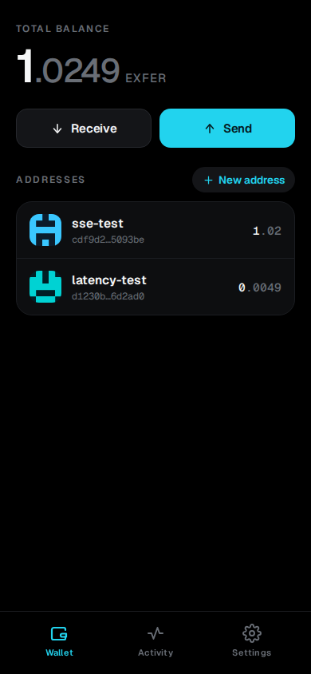
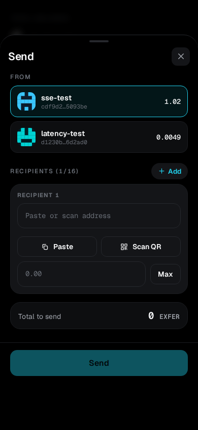
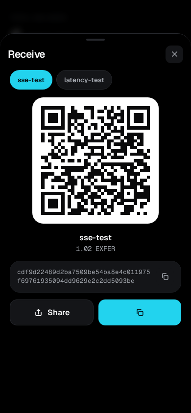
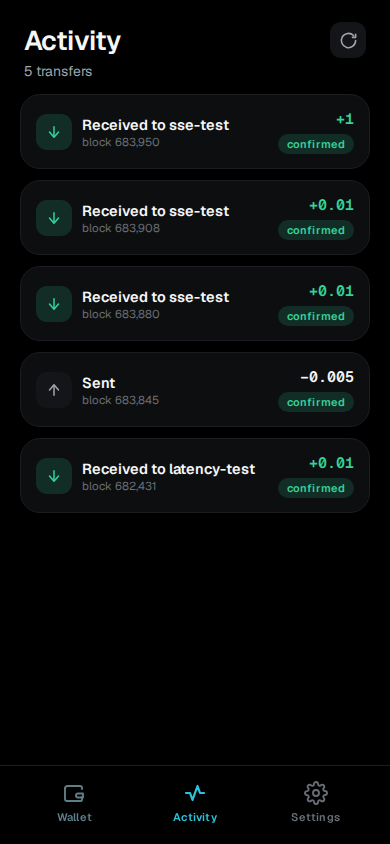
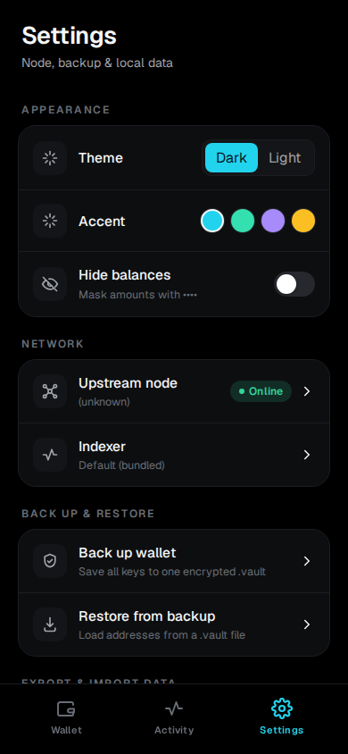

<h1 align="center">exfer-wallet</h1>

<p align="center"><b>A fast, lightweight mobile wallet for the Exfer blockchain.</b></p>

<p align="center">
  <a href="LICENSE"></a>
</p>

iOS and Android, one codebase. No account, no server to run, no browser
extension. Set a password and you're in.

**Lightweight** — the wallet engine (`exfer-walletd`) is embedded *inside the
app, on your phone*. There's no separate daemon to install and nothing to keep
running in the background. The app only reaches out to a public Exfer node to
read balances and broadcast a send.

**Yours** — keys are generated and stored on the device and never leave it. The
on-device UI talks to the embedded engine over a pinned loopback channel, so the
screen you see never makes a network call of its own.

**Fast** — a hand-written, token-based stylesheet (no Tailwind, no UI framework
bloat), a pure-black canvas with a single cyan accent, and Geist / Geist Mono.

## Screens

<table>
  <tr>
    <td align="center"></td>
    <td align="center"></td>
    <td align="center"></td>
    <td align="center"></td>
    <td align="center"></td>
  </tr>
  <tr>
    <td align="center"><b>Wallet</b><br/>balance + addresses</td>
    <td align="center"><b>Send</b><br/>up to 16 recipients</td>
    <td align="center"><b>Receive</b><br/>QR + copy</td>
    <td align="center"><b>Activity</b><br/>on-chain history</td>
    <td align="center"><b>Settings</b><br/>theme · node · backup</td>
  </tr>
</table>

A bottom tab bar — **Wallet** / **Activity** / **Settings**. Receive, Send, and
each address's detail open as full-screen sheets. First launch creates a
password-encrypted wallet or restores one from a `.vault` backup.

## What you can do

Every address is its own independent key with its own lifecycle (a flat
keyring — no single master seed behind everything):

- **Receive** — QR + copyable address. Mint a fresh address per payer for privacy.
- **Send** — multiple recipients, live fee preview, broadcast → receipt.
- **Recovery phrase** — each address has its own 24 words.
- **Delete for real** — with a funds guard that refuses a non-empty address unless you confirm the balance is unrecoverable.
- **Vault backup** — seal the whole keyring into one encrypted `.vault` file. No seed phrase to write down.
- **Import** — bring in an address from a 24-word phrase or an encrypted `wallet.key` (EXFK) file.

Settings covers appearance (theme / accent / hide-balance), the upstream node,
vault backup & restore, daemon status, biometric unlock, and a
typed-confirmation wipe.

## Install

### Android

Each release attaches an installable `.apk`.

1. On your phone, open the **[latest release](https://github.com/exfer-stack/exfer-walletd-mobile/releases/latest)**.
2. Download the `.apk` asset (e.g. `exfer-wallet_<version>_arm64.apk`).
3. Tap the file. Android will ask to allow installs from this source — enable it (**Settings → Apps → your browser → Install unknown apps**), then tap **Install**.
4. Open **exfer wallet**, set a password, and you're in.

Notes:

- Early test builds are **debug-signed** so they install without a Play account. Android may warn it's from an unknown developer — expected for a sideloaded build. A Play Store listing follows once a release signing key is provisioned.
- Builds target **arm64 (arm64-v8a)** — every phone since ~2017. Very old 32-bit devices aren't supported by the test APK.
- Minimum **Android 9 (API 28)**.

### iOS

iOS doesn't allow sideloading `.ipa` files. The iPhone build ships through
**TestFlight / the App Store** once Apple signing is provisioned. Until then,
wait for the TestFlight invite.

## Develop

```bash
npm install
npm run dev                # browser UI only (in-browser mock backend)
npm run tauri ios dev      # iOS simulator/device, real embedded walletd
npm run tauri android dev  # Android emulator/device, real embedded walletd
```

`npm run dev` serves the full UI against an in-browser mock (`src/lib/devmock.ts`)
so you can iterate on screens without the native toolchain. The real backend
only runs inside a Tauri build.

Native targets need Xcode (iOS) or Android Studio + NDK 26 + JDK 17 (Android):
https://v2.tauri.app/start/prerequisites/

Built with **Tauri 2 + React 19 + TypeScript + Vite**. It's the mobile sibling of
[`exfer-walletd-desktop`](https://github.com/exfer-stack/exfer-walletd-desktop)
and reuses that app's Rust core (`walletd_supervisor`, `rpc_client`,
`export_key`) and React data layer (`src/lib/*`) unchanged, adding a
phone-native UI on top.

## Release

A pushed `v*` tag (`git tag vX.Y.Z && git push origin vX.Y.Z`) runs
`.github/workflows/release.yml`, which builds the Android `.apk` (plus a signed
`.aab` → Play and `.ipa` → TestFlight once secrets are set) and publishes a
GitHub Release with the APK attached. Signing secrets, CI gates, and native
camera / biometric setup are in **[`docs/RELEASE.md`](docs/RELEASE.md)**.

## App identity

- App id: `com.exfer.wallet` · Product: `exfer-wallet`
- iOS 14.0+ · Android 9 (API 28)+
